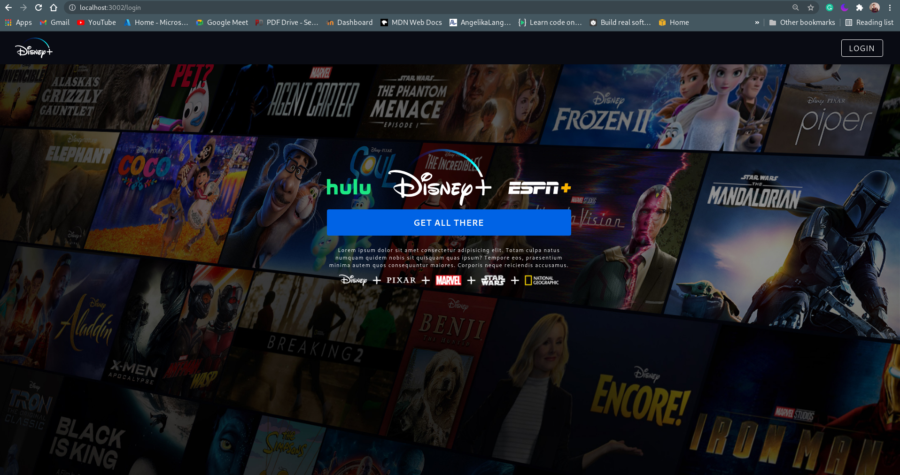
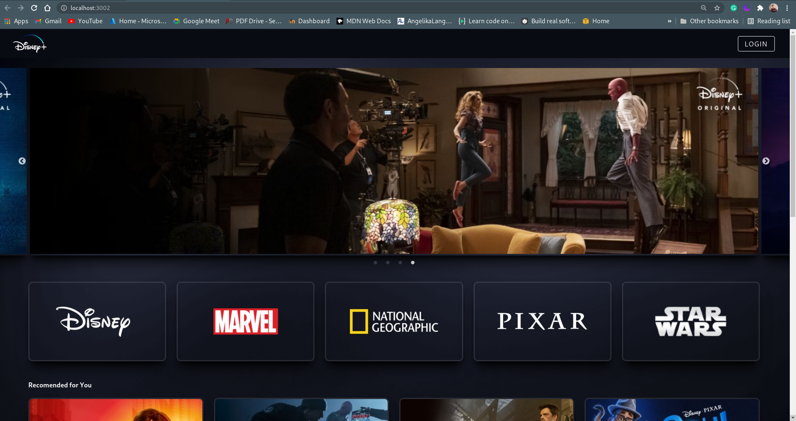

<!-- Please update value in the {}  -->

<h1 align="center">Diseny-clone</h1>

<!-- TABLE OF CONTENTS -->

## Table of Contents

- [Overview](#overview)
- [Built With](#built-with)
- [Features](#features)
- [Set Up Guide](#SetUpGuide)
- [Contact](#contact)

<!-- OVERVIEW -->

## Overview

### Built With

<!-- This section should list any major frameworks that you built your project using. Here are a few examples.-->

- React 
- React router
- Styled components
- Redux toolkit
- firebase authentication

## Features

<!-- List the features of your application or follow the template. Don't share the figma file here :) -->

- user signup and  login 
- show all movies list 
- showing the detail page  on click of a movie 
- cool animations

###  Set Up Guide

- fork the repository and clone to your local Set Up
- make sure that you  have `node ` installed
- run this command to install the node modules  `npm install` 
- now you can see the project in your browser by executing this command `npm start`
- That's  it now you can have fun exploring this project

## Contact

<h1> Majjikishore</h1>
